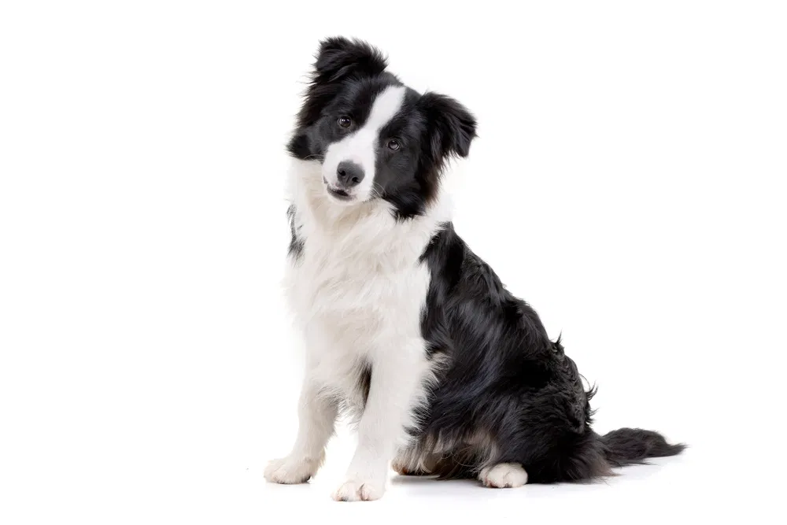
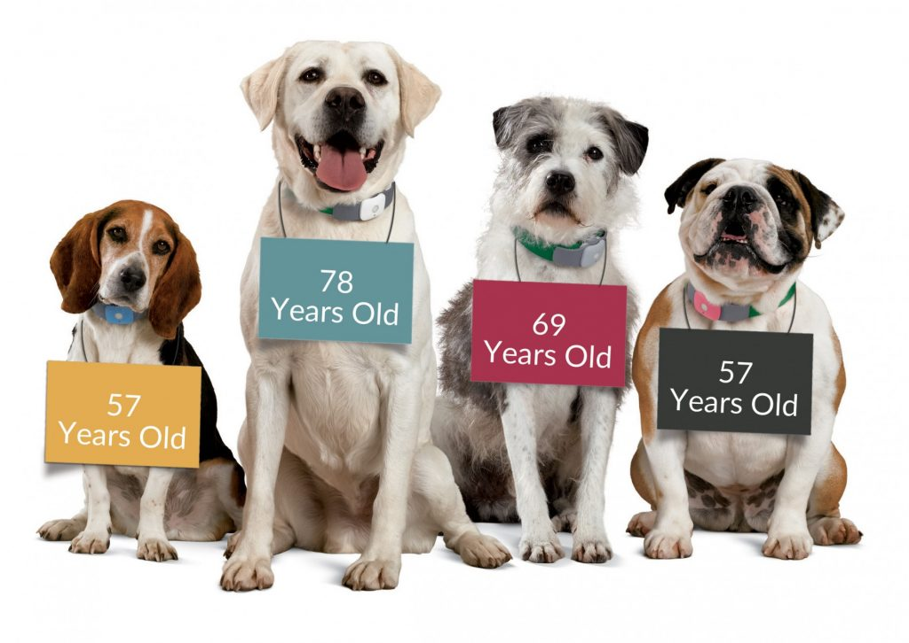

```{r setup, include=FALSE}
library(readr)
library(ggplot2)
library(dplyr)
library(tidyr)
library(plotly)
library(scales)
library(tidyverse)
library(stringr)
library(lubridate)
library(xtable)
library(pdftools)
library(janitor)
library(knitr)
library(kableExtra)
library(htmltools)
library(DT)
library(ggcats)
library(ggthemes)
library(reactable)
library(htmlwidgets)
library(jsonlite)
library(shiny)

```

```{r message=FALSE, warning=FALSE, include=FALSE}

train <- read_csv("~/Downloads/Github/newrepo/Data/train.csv")

ahs_intake <- read_csv("~/Downloads/Github/newrepo/Data/tabula-ahs_fy15-fy20-2.csv")

ahs_2021 <- read_csv("~/Downloads/Github/newrepo/Data/tabula-public-accountability-stats-2021_updated-8.5.21_0-2.csv")

```

{width="486"}

# Introduction

By the end of 2018, the estimated percentage of US households reported to having at least one pet was around 70%.
Among the companion animals, dogs and cats appear have been the most popular pets historically.
In 2018, there approximately 184 Million dogs and cats are living as household companion animals in the United States.
Each year, the number of cats and dogs entering animal shelters are around 7 Million.

As a professional animal enthusiast, my goal is to gather information from pet ownership and shelter statistics, and identify trends in animal outcomes in order to understand factors with significant impacts on pet adoption.
During the process, I hope to highlight strengths, weaknesses, and progress made by animal lovers everywhere, to continue efforts in raising awareness and advocating for animals without a home.

------------------------------------------------------------------------

# The Data Sets

##  {.tabset}

### About

1.  Animal Humane Society

The first data set records the outcome and intake statistics from the Humane society from 2015-2020.
This data set was used to investigate shelter intake groups by reason for surrender, as well as euthanasia by reason for surrender.

The second data set is the monthly total intake and outcome statistics.
January - July).
I wanted to focus on the numbers with this data set to explore the impact of COVID-19 on the shelters specifically.

3.  Austin Animal Shelter

The data sets is provided by a Kaggle hosted competition for the machine learning community to use for data science practice and social good.
The original data source is the Austin Animal Center, taken from the [merican society for the prevention of cruelty to animals](https://www.aspca.org)

### Methods

The data sets from the humane society were scraped as pdf files using Tabula.
They are available for download from their [live saving statistics](https://www.animalhumanesociety.org/about/lifesaving-statistics) website.
Since both data sets were extracted as whole pdf formats, I filtered through parts of the data sets relevant, and covert column types accordingly.

The Austin animal shelter data was downloaded and imported directly from [Kaggle's](https://www.kaggle.com/c/shelter-animal-outcomes/data) website for the "Shelter Animal Outcomes" competition.

Besides parsing to appropriate column types, I also converted most numbers into percentages.
When comparing differences between variables such as dog vs. cat or each year, numbers alone could be misleading without the total count.

Image sources:

[cover page](%22https://www.google.com/url?sa=i&url=https%3A%2F%2Fwww.123rf.com%2Fphoto_96473296_cat-dog-and-rabbit-sitting-together-isolated-on-white-background-.html&psig=AOvVaw2_g3Ur_H__iCpChrzJ8xzd&ust=1630247317835000&source=images&cd=vfe&ved=0CAsQjRxqFwoTCJii2auk1_ICFQAAAAAdAAAAABAD%22)

[group of dogs](%22https://www.google.com/url?sa=i&url=https%3A%2F%2Faspengrovevet.com%2Fdog-care%2Fdog-senior-citizen%2F&psig=AOvVaw0rdkwNQWWaWKqsSapllXVK&ust=1630340258894000&source=images&cd=vfe&ved=0CAsQjRxqFwoTCMCk6PXQ1vICFQAAAAAdAAAAABAs%22)

[funny dog](%22https://www.google.com/url?sa=i&url=https%3A%2F%2Fwww.thesprucepets.com%2Ffunny-names-for-dogs-4797856&psig=AOvVaw1XDQ42GEv3jMZ7MMkD3asA&ust=1630511356965000&source=images&cd=vfe&ved=0CAsQjRxqFwoTCJjk4KbO2_ICFQAAAAAdAAAAABAD%22)

[The cat](%22https://www.google.com/url?sa=i&url=https%3A%2F%2Fwww.scientificamerican.com%2Farticle%2Fcats-recognize-their-own-names-even-if-they-choose-to-ignore-them%2F&psig=AOvVaw1ZqdUROfU-oLb1Ds1UnmCN&ust=1630512447851000&source=images&cd=vfe&ved=0CAsQjRxqFwoTCMC-zqzS2_ICFQAAAAAdAAAAABAD%22)

```{r message=FALSE, warning=FALSE, include=FALSE}
austin <- train %>%
  select(2:4, 6:10) %>%
  mutate( Date = ymd_hms(DateTime),
          Year = year(Date),
          Month = month(Date)) %>%
  separate(SexuponOutcome, c("SexuponOutcome", "sex")) %>%
  select(11,12, 1, 3:9)


```

```{r message=FALSE, warning=FALSE, include=FALSE}
ahs <- as_tibble(ahs_intake) %>%
  rename( "2015" = "FY15","2016" = "FY16",
          "2017" = "FY17","2018" = "FY18",
          "2019" = "FY19","2020" = "FY20")
```

```{r include=FALSE}
dogs <- austin %>%
  filter(AnimalType == "Dog") %>%
 arrange(Year)

dog_outcomes <- dogs %>%
  group_by(Year) %>% count(OutcomeType)

cats <- austin %>%
  filter(AnimalType == "Cat") %>%
 arrange(Year)

cat_outcomes <- cats %>%
  group_by(Year) %>% count(OutcomeType)

```

------------------------------------------------------------------------

```{r message=FALSE, warning=FALSE, include=FALSE}

dog_male <- dogs %>% filter(sex == "Male")
 
dog_female <-  dogs %>% filter(sex == "Female")

dog_unknown <-  dogs %>% filter(SexuponOutcome == "Unknown")


cat_male <- cats %>% filter(sex == "Male")
 
cat_female <-  cats %>% filter(sex == "Female")

cat_unknown <-  cats %>% filter(SexuponOutcome == "Unknown")
```

```{r message=FALSE, warning=FALSE, include=FALSE}
dog_breed <- dogs %>%
  select(Breed) %>%
  count(Breed, sort = TRUE)

dog_mixed <- dogs %>%
  filter(str_detect(Breed, "Mix")) %>% 
 filter(OutcomeType == "Adoption") %>% 
 select(Breed) %>%
 slice(1:10)

cat_breed <- cats %>%
  select(Breed) %>%
  count(Breed, sort = TRUE)

cat_mixed <- cats %>%
  filter(str_detect(Breed, "Mix")) %>% 
 filter(OutcomeType == "Adoption") %>% 
 select(Breed) %>%
 slice(1:10)

```

```{r include=FALSE}
#ahs
monthly <- as_tibble(ahs_2021) %>%
  clean_names() %>%
  select(intakes,total) %>%
  filter(intakes == "TOTAL INTAKES" | intakes == "TOTAL OUTCOMES") %>%
  mutate(
    dates = rep(1:7, each = 2),
    total = parse_number(total)
  ) %>%
 mutate(dates = as.character(dates),
        dates = parse_factor(dates)) %>%
  mutate(dates = fct_recode(dates, 
                            "Jan" = "1", "Feb" = "2", "Mar" =
                              "3","Apr" = "4", "May" = "5", "Jun" =
                             "6", "Jul" = "7"))
```

------------------------------------------------------------------------

# As of 2021

```{r}
#ahs 2021
ggplot(monthly, aes(dates, total, group = intakes, 
                    color = intakes)) +
  geom_line(size = 1) +
  geom_point(size = 4) +
  labs(subtitle = "2021 Intake & Outcome Summary") 
 
```

In the beginning of 2020, many have been working and studying from home during the lock down.
Animal shelters experienced higher than ever adoption rates.
As in-person work and school resumes, concerns were raised about pets adopted during the pandemic are getting surrendered and returned to the shelter when the owners no longer work from home full time.
From the humane society's report from January to this summer, both intakes and outcomes increased dramatically within one month and have been increasing more steadily in the spring.

------------------------------------------------------------------------

```{r message=FALSE, warning=FALSE, include=FALSE}
surrender <- as_tibble(ahs) %>%
  slice(3:7) %>%
  rename( 'Surrender_Intake'  =  'Animal Intake and Outcomes') %>% 
  pivot_longer(c('2015', '2016', '2017', '2018','2019', '2020'), names_to = "year", values_to =  "cases") %>%
  clean_names() %>%
  pivot_wider(names_from = surrender_intake, values_from = cases) %>%
  clean_names() %>%
  rename(surrender = owner_surrender,
         transfer = transfer_from_animal_welfare_partner,
         cruelty = cruelty_case)
```

```{r include=FALSE}
surrender_stat <- surrender %>%
    mutate(surrender = parse_number(surrender),
         transfer = parse_number(transfer),
         stray = parse_number(stray),
         cruelty = parse_number(cruelty),
         total = parse_number(total),
         year = parse_number(year)) %>%
  summarize(surrender = percent(surrender/total, accuracy = 0.01),
            transfer = percent(transfer/total, accuracy = 0.1),
            stray = percent(stray/total,accuracy = 0.1),
            cruelty = percent(cruelty/total, accuracy = 0.1),
            year = year) %>%
  pivot_longer(c( "surrender", "transfer", "stray", "cruelty"), names_to = "reason", values_to = "cases") %>%
  pivot_wider(names_from = year, values_from = cases)
```

# Where do they come from

##  {.tabset}

### Table

```{r}
kable(surrender_stat, 
      col.names = c(" ", "2015", "2016", "2017", "2018", "2019", "2020"), digits = 2) %>%
      kable_styling("striped") 
#humane society f2015-2020
```

### Plot

```{r}
surr_plot <- surrender_stat %>% pivot_longer(c("2015", "2016", "2017", "2018", "2019", "2020"), names_to = "year", values_to = "cases") %>%
  mutate(cases = parse_number(cases),
         year = parse_number(year))

ggplot(surr_plot, aes(year, cases, fill = reason)) +
  geom_col(position = position_dodge2(width = 1), width = 0.7) +
  facet_wrap(~reason, scales = "free_y") +
  theme_minimal() +
  theme(legend.position = "none") 

```

##  {.unnumbered}

The owner surrender rate has a slight decline from 2015-2020.
The increase in stray animal intakes could be the indication that more animals are being abandoned by their owners; However, I interpret it as the shelters' effort in rescuing more animals over the years.
Cruelty cases spiked from 2016-2018, but decreased by almost 2% by 2020.

```{r include=FALSE}
#adopted numbers over years 2013-2016 Austin
  
outcome_trend <- austin %>%
  group_by(Year) %>%
  count(OutcomeType, AnimalType,sort = TRUE) %>%
 pivot_wider(names_from = OutcomeType, values_from = n) %>%
 mutate(all_animal = rowSums(across(where(is.numeric)))) %>%
 mutate(Adoption = Adoption/all_animal,
        Transfer = Transfer/all_animal,
        Return_to_owner = Return_to_owner/all_animal,
        Euthanasia = Euthanasia/all_animal,
        Died = Died/all_animal) %>% select(-8) %>%
 pivot_longer(c("Adoption","Transfer", "Return_to_owner", "Euthanasia", "Died"),names_to = "OutcomeType")
```

```{r include=FALSE}
#change theme
theme_gppr <- function(){ 
    font <- "Georgia"  
    theme_minimal() %+replace% 
    theme(
      #grid elements
      panel.grid.major = element_blank(),    #strip major gridlines
      panel.grid.minor = element_blank(),    #strip minor gridlines
      axis.ticks = element_blank(),          #strip axis ticks
      #text elements
      plot.title = element_text(             #title
                   family = font,            #set font family
                   size = 20,                #set font size
                   face = 'bold',            #bold typeface
                   hjust = 0,                #left align
                   vjust = 2),               #raise slightly
      plot.subtitle = element_text(          #subtitle
                   family = font,            #font family
                   size = 14),               #font size
      plot.caption = element_text(           #caption
                   family = font,            #font family
                   size = 9,                 #font size
                   hjust = 1),               #right align
      
      axis.title = element_text(             #axis titles
                   family = font,            #font family
                   size = 10),               #font size
      axis.text = element_text(              #axis text
                   family = font,            #axis famuly
                   size = 9),                #font size
      axis.text.x = element_text(            #margin for axis text
                    margin= margin(5, b = 10))
    )
}
```

------------------------------------------------------------------------

# Outcomes & Trends

```{r}
# austin all 2013-16
ggplot(outcome_trend, aes(factor(Year), value, fill = AnimalType)) +
  geom_col(position = "dodge", width = 0.7) +
 facet_wrap(~ OutcomeType, scales = "free_y", ncol = 2) +
 scale_fill_brewer(palette = "Reds") +
labs(x = "Year" , y = NULL) +
  theme_minimal()


```

This is a glimpse of the outcomes from the Austin animal shelter from 2013-2016.
It is encouraging that overall euthanasia rate has decreased over the years.
However, euthanasia in cats is far greater than dogs and considerably slower progress.
Surprisingly, there are around 25-30 % shelter dogs returned to their owners each year, which has increased over the years, but that is not the case in cats.

```{r include=FALSE}
cat_annual <- outcome_trend %>%
  filter(AnimalType == "Cat") %>%
  pivot_wider(names_from = OutcomeType, values_from = value) %>%
  summarize(
    Transfer = percent(Transfer, accuracy = 0.1),
    Adoption = percent(Adoption, accuracy = 0.1),
    Euthanasia = percent(Euthanasia, accuracy = 0.1),
    Return_to_owner = percent(Return_to_owner, accuracy = 0.1),
    Died = percent(Died, accuracy = 0.1)) %>%
    pivot_longer(c("Transfer", "Adoption", "Euthanasia", "Return_to_owner", "Died"), 
                 values_to = "cases") %>%
      pivot_wider(names_from = Year, values_from = cases)


dog_annual <- outcome_trend %>%
  filter(AnimalType == "Dog") %>%
  pivot_wider(names_from = OutcomeType, values_from = value) %>%
  summarize(
    Transfer = percent(Transfer, accuracy = 0.1),
    Adoption = percent(Adoption, accuracy = 0.1),
    Euthanasia = percent(Euthanasia, accuracy = 0.1),
    Return_to_owner = percent(Return_to_owner, accuracy = 0.1),
    Died = percent(Died, accuracy = 0.1)) %>%
    pivot_longer(c("Transfer", "Adoption", "Euthanasia", "Return_to_owner", "Died"), 
                 values_to = "cases") %>%
      pivot_wider(names_from = Year, values_from = cases)
```

------------------------------------------------------------------------

## Dog Outcomes 2013-2016 {.tabset}

### Table

```{r include=FALSE}
dog_table <- dog_outcomes %>% pivot_wider(names_from = OutcomeType, values_from = n ) 
```

```{r echo=FALSE}
kable(dog_annual, caption = "Dog Adoptions 2013-16", 
      col.names = c(" ", "2013", "2014", "2015", "2016")) %>%
      kable_styling("striped")
```

### Plot

```{r}
dog_plot <- dog_outcomes %>%
   group_by(Year) %>%
   mutate(total = sum(n),
          percent = n/total)

ggplot(dog_plot, aes(Year, percent, fill = OutcomeType)) +
  geom_col(position = "dodge") +
 facet_wrap(~OutcomeType, scales = "free_y") +
 #coord_flip() +
 theme_minimal()
  
  #ggplot(dog_outcomes, aes(Year, n, fill = OutcomeType)) +
  #geom_bar(position = position_dodge2(width = .5), width = 1) +
 
  
```

##  {.unnumbered}

{width="31%"}

------------------------------------------------------------------------

## Cat Outcomes 2013-2016 {.tabset}

### Table

```{r include=FALSE}
cat_table <- cat_outcomes %>% pivot_wider(names_from = OutcomeType, values_from = n ) 
```

```{r echo=FALSE}
kable(cat_annual, caption = "Cat Adoptions 2013-16", 
      col.names = c(" ", "2013", "2014", "2015", "2016")) %>%
      kable_styling("striped")
```

### Cat plot

```{r}
cat_plot <- cat_outcomes %>%
   group_by(Year) %>%
   mutate(total = sum(n),
          percent = n/total)

ggplot(cat_plot, aes(Year, percent, fill = OutcomeType)) +
  geom_col(position = "dodge") +
 facet_wrap(~OutcomeType, scales = "free_y") +
 #coord_flip() +
 theme_minimal()
  
```

##  {.unnumbered}

------------------------------------------------------------------------

# Euthanasia

The highlight for this table is that the proportion of animals with treatable conditions being euthanized decreased greatly over the years.
Most euthanized animals are from untreatable illnesses

```{r message=FALSE, warning=FALSE, include=FALSE}
euthanasia <- as_tibble(ahs) %>%
  slice(33:37) %>%
  rename("Euthanasia"  =  'Animal Intake and Outcomes') %>%
  pivot_longer(c('2015','2016','2017','2018','2019','2020'), names_to = "year",    values_to = "cases" ) %>%
  mutate(cases = parse_number(cases),
          cases = ifelse(is.na(cases), 0, cases),
         year = parse_number(year)) %>%
  filter(cases > 1) %>%
  filter(Euthanasia != "TOTAL")
```

##  {.tabset}

### Plot

```{r message=FALSE, warning=FALSE}
ggplot(euthanasia, aes(factor(year), cases, fill =
         Euthanasia, group = Euthanasia)) +
  geom_col(position = "dodge", width = 0.6) +
  geom_point() +
 geom_line() +
  facet_wrap(~Euthanasia, scales = "free_y", ncol= 1) +
  labs(x = NULL, y = NULL) +
  scale_fill_brewer(palette = "Oranges") +
  theme_minimal() +
  theme(legend.position = "none",
      plot.background = element_rect(colour = "black", size = 1)) 
  
```

### Table

```{r message=FALSE, warning=FALSE}
euth_table <- as_tibble(ahs) %>%
  slice(33:35) %>%
  rename("Euthanasia"  =  'Animal Intake and Outcomes') %>%
  pivot_longer(c('2015','2016','2017','2018','2019','2020'), 
               names_to = "year", values_to = "cases" ) %>%
  mutate(cases = parse_number(cases),
          cases = ifelse(is.na(cases), 0, cases),
         year = parse_number(year)) %>%
  group_by(year) %>%
  mutate( total = sum(cases),
         cases = percent( cases/total, accuracy = 0.01)) %>%
  select(-4) %>%
  pivot_wider(names_from = year, values_from = cases) 

kable(euth_table) %>% kable_styling("striped")
```

```{r include=FALSE}
unknown <- austin %>%
  filter(SexuponOutcome == "Unknown") %>%
  group_by(Year) %>%
  count(OutcomeType, sort = TRUE)
  
intact <- austin %>%
  filter(str_detect(SexuponOutcome, "Intact")) %>%
  group_by(Year) %>%
 count(OutcomeType, sort = TRUE) 

legal <- austin %>%
   group_by(Year) %>%
  filter(str_detect(SexuponOutcome, "Neutered|Spayed")) %>%
  count(OutcomeType)
```

```{r include=FALSE}
#Neutered or Not vs outcome
dog_sex <- dogs %>%
  filter(OutcomeType == "Adoption") %>%
  group_by(Year) %>%
  count(SexuponOutcome) %>%
  mutate(total = sum(n),
         cases = n/total) %>%
  select(-3,-4) 

```

```{r include=FALSE}
#Neutered or Not vs outcome
cat_sex <- cats %>%
  filter(OutcomeType == "Adoption") %>%
  group_by(Year) %>%
  count(SexuponOutcome) %>%
  mutate(total = sum(n),
         cases = n/total) %>%
  select(-3,-4) 

```

------------------------------------------------------------------------

# Spaying/neutering

##  {.tabset}

### Dogs neutered/spayed

```{r echo=FALSE}

ggplot(dog_sex, aes(Year, cases, fill = SexuponOutcome)) +
  geom_col(width = 0.8, position = "dodge") +
  facet_wrap(~SexuponOutcome, as.table = TRUE, scales = "fixed") +
  theme_economist() +
  theme(legend.position = "none") +
  scale_fill_brewer(palette = "Reds") +
  geom_text(aes(label = percent(cases, scale = 100, accuracy = 0.1)),
            vjust = 1.5, hjust = 0.5, size = 3) +
  labs(x = NULL, y = NULL)
  #note that there unknown animals found among the adopted
```

### Cat neutered/spayed

```{r echo=FALSE}

ggplot(cat_sex, aes(Year, cases, fill = SexuponOutcome)) +
  geom_col(width = 0.8, position = "dodge") +
  facet_wrap(~SexuponOutcome, as.table = TRUE, scales = "fixed") +
  theme_economist() +
  theme(legend.position = "none") +
  scale_fill_brewer(palette = "Reds") +
  geom_text(aes(label = percent(cases, scale = 100, accuracy = 0.1)),
            vjust = -.5, hjust = 0.5, size = 3) +
  labs(subtitle = "Cat spayed/neutered",x = NULL, y = NULL)

```

##  {.unnumbered}

Each year, most animals are spayed and neutered.
In some foster systems, animals are required to be spayed/neutered before adoption to prevent from more animals entering the shelters or euthanized.

------------------------------------------------------------------------

# Name & Adoption

##  {.tabset}

### cat with names

```{r echo=FALSE}
#names (yes no)

cats_named <- cats %>% 
  mutate(hasName = ifelse(is.na(Name), "No", "Yes")) %>%
  filter(OutcomeType == "Adoption") %>%
  count(hasName, sort = TRUE) %>%
  mutate(total = sum(n),
         n =  percent(n/total, accuracy = 1)) %>%
  select(hasName, n)

ggplot(cats_named, aes(x="", y= n, fill=  hasName)) +
  geom_bar(stat="identity", width=1, color="white") +
  coord_polar("y", start=0) +
  theme_void() +
  labs(title = "Adopted Cats with Names?" ) +
  scale_fill_discrete(name = "Name?") +
  geom_text(aes(label = n), position = position_stack(vjust = 0.5), size = 5)
```

### Dog with Names

```{r  include=FALSE}
dogs_named <- dogs %>% 
  mutate(hasName = ifelse(is.na(Name), "No", "Yes")) %>%
  filter(OutcomeType == "Adoption") %>%
  count(hasName, sort = TRUE) %>%
  mutate(total = sum(n),
         n =  percent(n/total, accuracy = 1)) %>%
  select(hasName, n)
```

```{r echo=FALSE}
ggplot(dogs_named, aes(x="", y= n, fill=  hasName)) +
  geom_bar(stat="identity", width=1, color="white") +
  coord_polar("y", start=0) +
  theme_void() +
  labs(title = "Adopted Dogs with Names?" ) +
  scale_fill_discrete(name = "Name?") +
  geom_text(aes(label = n), position = position_stack(vjust = 0.5), size = 5)


```

```{r include=FALSE}
#top names adopted

cname_f <- cats %>%
  filter(!is.na(Name)) %>%
  filter(OutcomeType == "Adoption") %>%
  filter(sex == "Female") %>%
  count(Name,sort = TRUE) %>%
  select(Name) %>%
  slice(1:10) %>%
  rename(Female = Name)
 
cname_m <- cats %>%
  filter(!is.na(Name)) %>%
  filter(OutcomeType == "Adoption") %>%
  filter(sex == "Male") %>%
  count(Name,sort = TRUE) %>%
  select(Name) %>%
  slice(1:10) %>%
  rename( Male = Name)

cat_names <- bind_cols(cname_f,cname_m)
```

```{r include=FALSE}
dname_f <- dogs %>%
  filter(!is.na(Name)) %>%
  filter(OutcomeType == "Adoption") %>%
  filter(sex == "Female") %>%
  count(Name,sort = TRUE) %>%
  select(Name) %>%
  slice(1:10) %>%
  rename(Female = Name)
 
dname_m <- dogs %>%
  filter(!is.na(Name)) %>%
  filter(OutcomeType == "Adoption") %>%
  filter(sex == "Male") %>%
  count(Name,sort = TRUE) %>%
  select(Name) %>%
  slice(1:10) %>%
  rename(Male = Name)


dog_names <- bind_cols(dname_f,dname_m)
```

## Did your pet make the popular name list? {.tabset}

### Dogs

```{r}

kable(dog_names, caption = "dog names", row.names = NA) %>%
      kable_styling("striped")
```

### Cats

```{r echo=FALSE}
kable(cat_names, caption = "cat names", row.names = NA) %>%
      kable_styling("striped")

```

------------------------------------------------------------------------

# Does color matter?

```{r}
#colors

cat_color <- cats %>%
  filter(OutcomeType == "Adoption") %>%
  count(Color, sort = TRUE) %>%
  slice(1:10) %>%
  rename(Cats = Color) %>% select(-2)

dog_color <- dogs %>%
  filter(OutcomeType == "Adoption") %>%
  count(Color, sort = TRUE) %>%
  slice(1:10) %>%
  rename( Dogs = Color) %>% select(-2)

popular_colors <- bind_cols(dog_color, cat_color)

kable(popular_colors) %>% kable_styling("striped")

```

# Popular mixed Breeds {width="113"}

```{r message=FALSE, warning=FALSE}

mixes <- bind_cols(dog_mixed, cat_mixed)

kable(mixes, col.names = c("Dogs", "Cats")) %>% kable_styling("striped")
```

------------------------------------------------------------------------

# Age

Puppies and Kittens are highly adoptable, especially kittens.
Besides the cuteness, some owners might take into account the health problems in older pets.
In adult cats, many might have a harder time getting adopted or have a higher chance of being returned due to compatiblity issues such as households with children, other animals, or simply another cat.
The age in this graph is counted in months.

```{r include=FALSE}
top_age <- austin %>%
  filter(OutcomeType == "Adoption") %>%
  separate(AgeuponOutcome, into = c("number", "time")) %>%
  filter(!is.na(time)) %>%
  mutate(convert = recode(time, 
  "years" = 12,
  "year" = 12,
  "weeks" = 0.25,
  "days" = 1/30,
  "day" = 1/30,
  "months" = 1,
  "month" = 1),
  number = parse_double(number),
  months = as.numeric(number) * convert) %>%
  select(OutcomeType, AnimalType, months)
```

```{r include=FALSE}

age_outcome <- top_age %>%
  mutate(months = cut(months, breaks = seq(0, 60, 10), right = TRUE)) %>%
  group_by(AnimalType) %>%
  count(months, sort = TRUE) %>%
  #mutate(months = order(months)) %>% 
  select(AnimalType, months, n) %>%
  filter(!is.na(months)) 
  
#try pyramid -- yoohoo
```

```{r}
ggplot(age_outcome, 
       aes( x = months,
            y = ifelse(AnimalType == "Cat", n, -n),
            fill = AnimalType )) +
  geom_bar(stat = "identity") +
  coord_flip() +
  scale_y_continuous(limits = c(-2500, 3500),
                     breaks = seq(-2500,3000,1500),
                     labels = abs) +
  labs(title = "Adoption distribution by Age",
       y = "Numbers Adopted", x = "Age in months") +
  theme (plot.title = element_text(size=10)) +
  theme_bw()


```

------------------------------------------------------------------------

# Summary Notes

It is important to note that these data sets and my methods aren't without weaknesses and bias.
Accurate shelter and rescuing data are hard to obtain since there is no central reporting system.
Overall numbers on pet owner statistics were collected from surveys, so we can only consider them as estimates.
The majority of these data set are already calculated and categorized as summaries.

For example, it is common for shelter animals to be returned if they are having a hard time settling in with the family.
I cannot trace the relationship between the adopted that were later returned.
The most important factor missing from these data is the "surrender by owner" statistics.
I think it would be worth while to understand why they are being surrendered.
Some of these might include financial, behavioral, or health problems, which can only be reported at the owner's discretion as well.

There are more questions to be asked and analyzed for animal adoptions.
Advocating for animals is an ongoing effort, and my work doesn't end with this project either.
These data reports may only be used mainly by shelters or rescuing groups.
I believe they would be powerful tools in educating pet owners or soon-to-be owners.
I will list some resources I found below.

Too often pets are being adopt or purchased when the owners aren't prepared and ready.
Taking an animal into our lives is a big commitment that should be taken seriously.
We shouldn't get a pet just because they're cute (even though they certainly are).
They might be chaotic drooling little monsters that demand food and attention 24/7, the friendship and companion with a animal is so so beautiful.

> He might only be here for a part of your life, but for him, you are his whole life.

------------------------------------------------------------------------

# Resources

[The American Veterinary Medical Association](http://www.avma.org)

[The National Council on Pet Population Study & Policy (NCPPSP)Shelter Animal Count](http://www.petpopulation.org)

[American Pet Products Association(APPA)](http://www.americanpetproducts.org/)

[Shelter Animal Count](https://www.shelteranimalscount.org)

[American society for the prevention of cruelty to animals(ASPCA)](https://www.aspca.org "American society for the prevention of cruelty to animals")

[Best Friends Animal Society](https://bestfriends.org)
